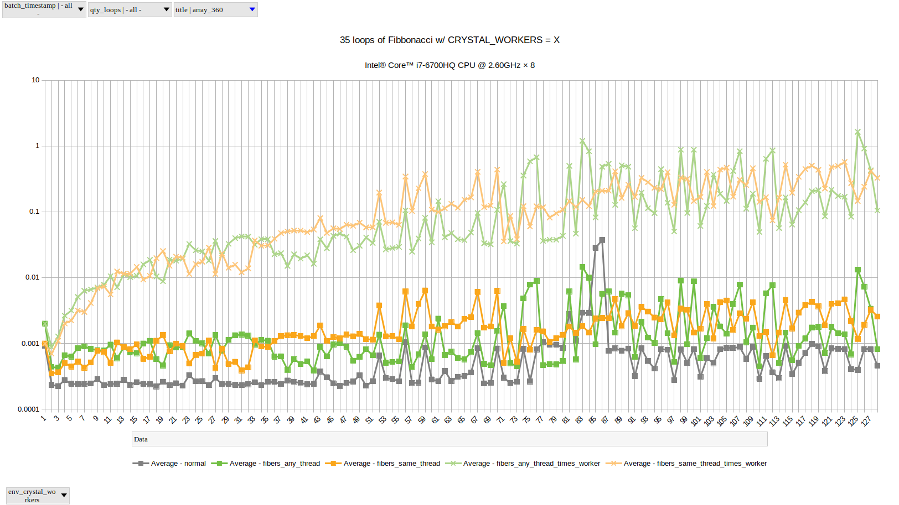

# [BENCH_VS](https://github.com/drhuffman12/bench_vs)

A collection of benchmarks for various algorithms and tools across various programming languages.

Feel free to fork and submit pull requests.

# Algorithms:

### Math

- [Node Times Weights Sum](./math/nodes_times_weights_sum/README.md)

### Regular vs Threaded/Fibered

- [Comparing 'regular' vs threaded/fibered runs of various algorithms](threads/README.md)

  - Fibanacci ('any-thread' fibers can help tremendously, but watch out for peaks and valleys)
    
  
  - Array 360 (minimal CPU usage, maximizing fiber overhead ratio)
    

# Tools:
