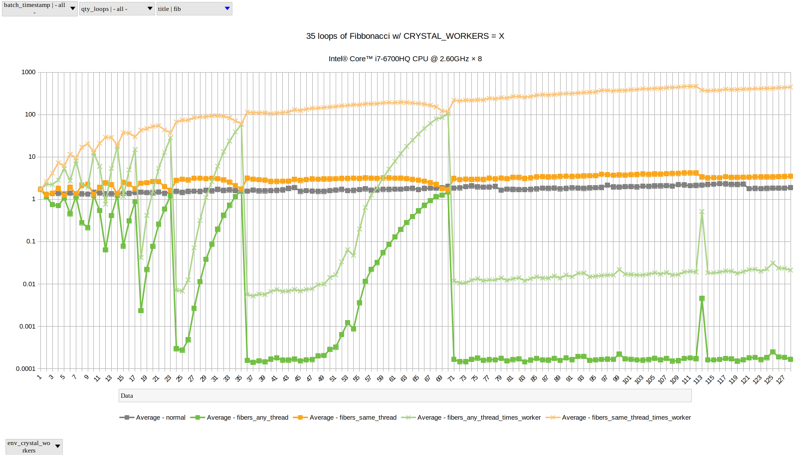

# [BENCH_VS](https://github.com/drhuffman12/bench_vs)

A collection of benchmarks for various algorithms and tools across various programming languages.

Feel free to fork and submit pull requests.

# Algorithms:

### Math

- [Node Times Weights Sum](./math/nodes_times_weights_sum/README.md)

### Regular vs Threads/Fibers/Processes

- [Comparing 'regular' vs threaded/fibered runs of various algorithms](threads/README.md)

  For Ruby vs Crystal:

  - Crystal (when compiled in release mode) is several times faster than the Ruby for 'regular' runs of Fibonacci. (Of coursem, your results can vary depending on what you are benchmarking!) If you go with threads/fibers/processes instead, your milage may vary tremendously.

  For Ruby:

  - TODO: compare fibers, compare processes w/ diff counts

  - But, basically, anything with minimal CPU usage us better off running 'normal';
    and anything heavy-cpu oriented is probably best with processes (or possibly fibers)

    ```
    # array_360:
          user     system      total        real
    normal ...
    normal  0.000907   0.000165   0.001072 (  0.001071)
    threads ...
    threads  0.004243   0.000772   0.005015 (  0.003814)
    processes ...
    processes  0.000000   0.019665   0.087256 (  0.021589)
    done for qty: 35

    # fib:
          user     system      total        real
    normal ...
    normal  4.102380   0.000000   4.102380 (  4.103209)
    threads ...
    threads  4.051552   0.003589   4.055141 (  4.058756)
    processes ...
    processes  0.000000   0.020610   4.570401 (  1.591108)
    done for qty: 35
    ```

  For Crystal-lang:

    We have some fiber optimization options to compare.
  
  - Fibonacci ('any-thread' fibers and high CRYSTAL_WORKERS count can help tremendously, but watch out for peaks and valleys!)
    
  
  - Array 360 (minimal CPU usage, maximizing fiber overhead ratio)
    

# Tools:
