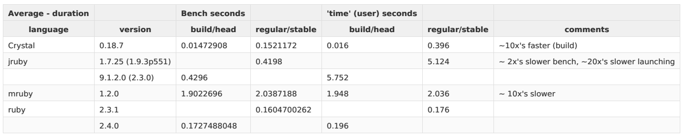

# This benchmark compares a neural-network-like algorithm. 

For Neural Networks, you typically take use various propogation functions to a 1D array of inputs and a 2D array of weights into a 1D array of outputs.

Here we are just multiplying the inputs acros the weights and summing up the partial results to get the outputs with the following pseudo-code:
   
   * generate a 1D array (i.e.: n1) of random values
   * generate a 2D array (i.e.: w1) of random values
   * for each element in a 1D array (e.g.: n1[i])
     - multiply to each element in a slice of a 2D array horizontally into a 2D array of partial results (e.g.: w2[i,j] = n1[i]*w1[i,j])
   * then, sum up the columns of resulting values (e.g.: n2[j] = sum(w2[*,j]) 

# Dependancies:
 * rvm ("https://rvm.io/")
 * crenv ("https://github.com/pine/crenv")
 * crenv-update ("https://github.com/pine/crenv-update")

# Results:   

(See various files under the "stats" folder.)

TODO: 
 * To try to get faster MRuby times (and to get a self-contained executable for other comparisons):
   - Clone the MRuby repo
   - embed the bench test file (wrapped in a class to make it easier to call) into the clone folder
   - mod `collect.sh` to use the embedded version (i.e.: re-build mruby w/ the bench code embedded into the mruby binary)                   
   - re-build and re-run the benchmarks  

## Linux

### Mint 17.3 KDE

#### Lenovo

##### Ideapad Y700

