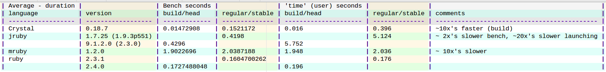
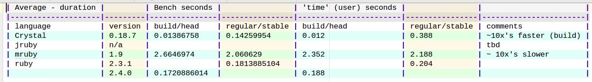

# This benchmark compares a neural-network-like algorithm. 

## USAGE:

```sh
./setup.sh
./run.sh <stats>/<os>/<osver>/<brand>/<model>
```

For Neural Networks, you typically take use various propogation functions to a 1D array of inputs and a 2D array of weights into a 1D array of outputs.

Here we are just multiplying the inputs acros the weights and summing up the partial results to get the outputs with the following pseudo-code:
   
   * generate a 1D array (i.e.: n1) of random values
   * generate a 2D array (i.e.: w1) of random values
   * for each element in a 1D array (e.g.: n1[i])
     - multiply to each element in a slice of a 2D array horizontally into a 2D array of partial results (e.g.: w2[i,j] = n1[i]*w1[i,j])
   * then, sum up the columns of resulting values (e.g.: n2[j] = sum(w2[*,j]) 

# Dependancies:
 * rvm ("https://rvm.io/")
 * crenv ("https://github.com/pine/crenv")
 * crenv-update ("https://github.com/pine/crenv-update")

# Results:   

(See various files under the "stats" folder.)
(See "http://www.tablesgenerator.com/markdown_tables" for handy md table generator.)

## Linux

### Mint 17.3 KDE

#### Lenovo

##### Ideapad Y700



### Mint 18 Mate

#### Apple

##### MacBookPro A1398



# Conclusion:

For this particular benchmark:
* Speed:
  - Crystal (in 'default' mode) loads about half as fast as Ruby and runs about the same as Ruby
  - Crystal (in 'release' mode) loads and runs about 10x's faster than Ruby
  - JRuby (in any mode) loads about 30x's slower than Ruby and runs about 2.5x's slower Ruby
  - MRuby (in any mode) loads and runs about 10x's slower than Ruby

* Size of 'built' files, compared to the source files, which are about 1 1/4 KB:
  - MRuby 'mrb' file is the smallest at about 1 1/4 Kb, practically the same size as the source code. (The 'mrb' still needs the 'mruby' binary to run it, but that's probably ok if you have multiple 'mrb' files to run via the same mruby 'bin'.)
  - Crystal is the smallest completely self-containted binary at about 1/2 MB
  - MRuby 'bin' (self-containted w/ the 'bench' file 'classified and embedded') is largest at about 1 1/2 MB (However, I kept getting `Segmentation fault` errors when I tried running it that way, i.e.:`mruby/bench -e "Bench.run(1000)"`. I'd need to look into that more later.)

* Results were proportionally similar (per language) across tested devices:
  - Lenovo Y700, Mint KDE 17.3
  - Apple MacBookPro, Mint Mate 18
  - Asus Zenfone2 ze551ml, Gnuroot

* Crystal wins this round; it seems a good balance of high speed, small built file size, and fairly Ruby-like syntax.

Of course, the 'winners' might vary as you test on other systems, translate to other programming languages, apply various optimizations, scale up the amount of source code, and include other types of algorithms being benchmarked.
