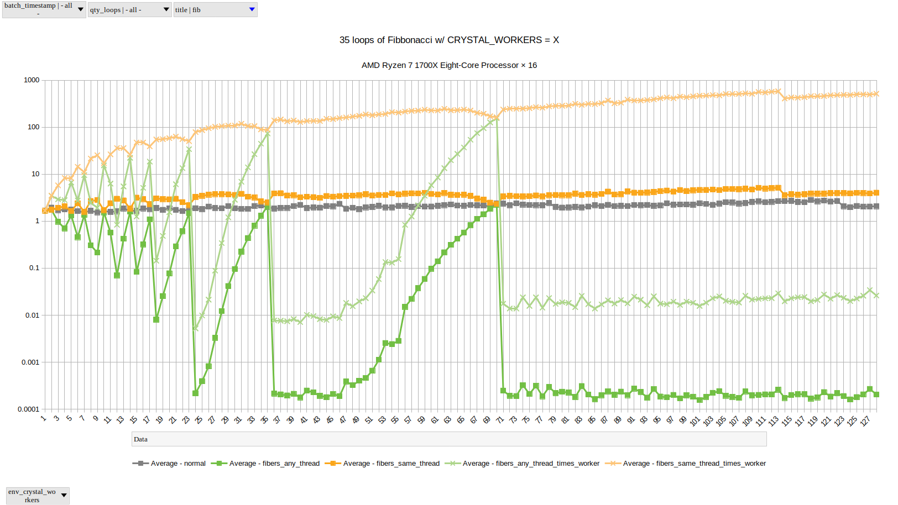
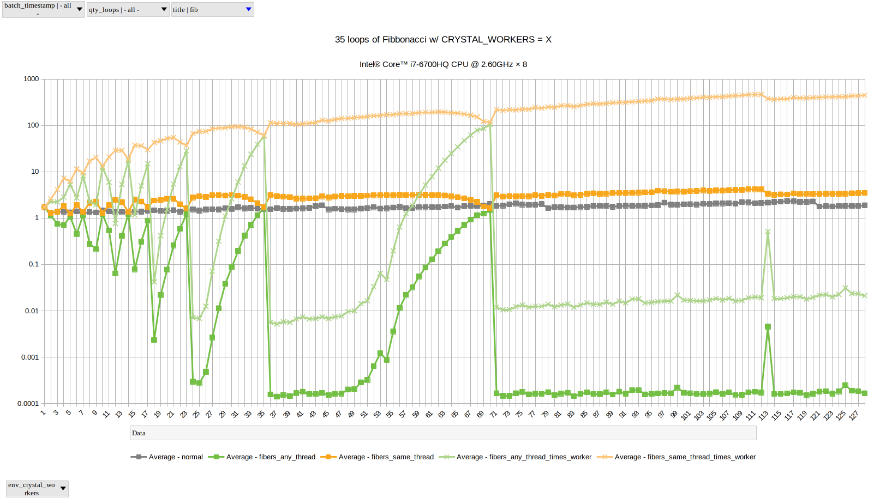
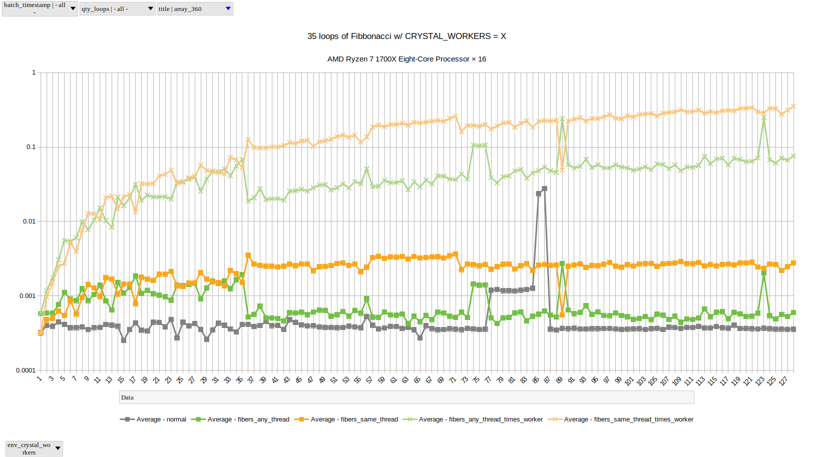
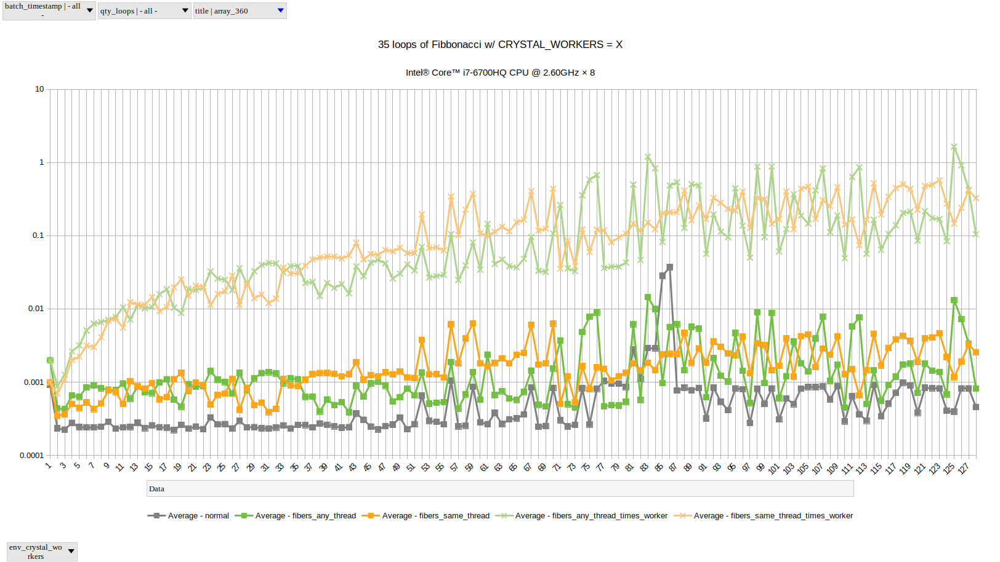

# Comparing Threads, Fibers, Plain (and TODO: Processes)

- Comparing repeated runs of some simple calcs and transformations with 1 to 128 CRYSTAL_WORKERS,
  we have some interesting spikes and dips in performance
  which almost match on an Intel and an AMD based systems. See charts below (w/ logrithmic scaled vertical 'real' benchmark times and horizontal worker counts).

  The gray is 'regular' non-threaded and non-fibered runs.

  The darker yellow/orange is for 'same-thread' fibers; with light yellow being real time times worker count.
   
  The darker green is for 'any-thread' fibers; with the light green being real time times worker count.

  - [Fibanacci](threads/README.md)

    The net effect of 'same-thread' fibers is typically WORSE than 'regular' runs.

    The net effect of 'any-thread' fibersis typically BETTER than 'regular' runs. There is a definite dip/spike pattern. 

    - Intel® Core™ i7-6700HQ CPU @ 2.60GHz × 8
      

    - AMD Ryzen 7 1700X Eight-Core Processor × 16
      

  - [Array 360](threads/README.md)

    Apparently, the fiber overhead out-weights the code being tested; 'regular' is best, but 'any-thread' vs 'same-thread' all over the place and kinda depends on how many workers you're using.

    - Intel® Core™ i7-6700HQ CPU @ 2.60GHz × 8
      

    - AMD Ryzen 7 1700X Eight-Core Processor × 16
      

## Ruby

```bash
cd $BENCH_ROOT
cd ruby
# BENCH_QTY_LOOPS=NNNN ruby bench.rb
# e.g.:
BENCH_QTY_LOOPS=35 ruby bench.rb
```

## Crystal

```bash
cd $BENCH_ROOT
cd crystal
./build.sh
# BENCH_QTY_LOOPS=NNNN ./run.sh
# e.g.:
BENCH_QTY_LOOPS=35 ./run.sh
```

## Both

```bash
# BENCH_QTY_LOOPS=NNNN ./build_and_run_all.sh
# e.g.:
BENCH_QTY_LOOPS=35 bash ./run.sh
```

## Debug

```bash
BENCH_QTY_LOOPS=35 CRYSTAL_WORKERS=7 crystal bench.cr -d
```
